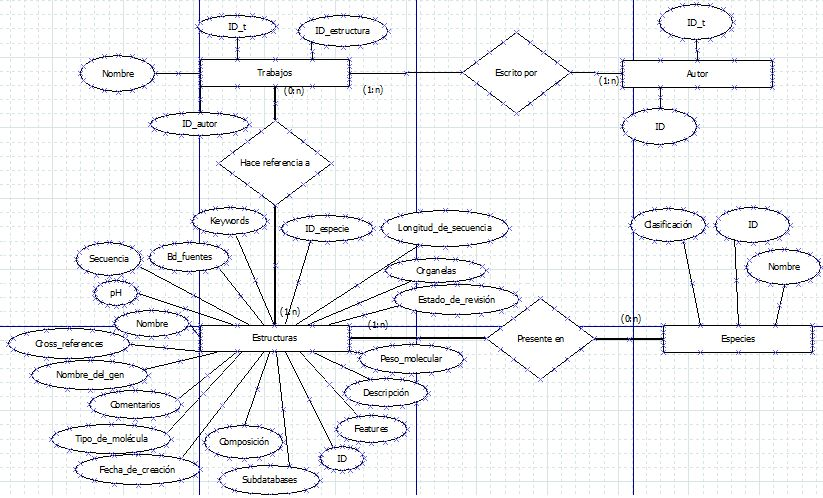

# Protein Structures

A relational database project focused on modeling, storing and querying information about protein structures, species and related scientific publications.

The database stores information about protein structures, including molecular characteristics, sequences, associated species, authors and scientific works.

## Database Model

The database is organized around four main entities:

- **Structures:** stores information about protein structures, including pH, sequence length, molecular type, molecular weight, sequence and other characteristics.
- **Species:** stores species information and taxonomic classification.
- **Authors:** stores authors associated with scientific works.
- **Works:** stores scientific publications associated with protein structures and their authors.

The entity-relationship model defines the relationships between these entities.



## SQL Queries

The project includes SQL queries for analyzing and retrieving information from the database.

Examples include:

- Retrieving proteins belonging to a specific species.
- Finding the most referenced protein and its associated scientific works.
- Finding the protein with the longest sequence.
- Finding the protein with the shortest sequence.
- Identifying the species with the largest number of proteins.
- Finding proteins with a pH above the average pH.

The queries make use of filtering, joins, subqueries, aggregation and functions such as `COUNT`, `MAX`, `MIN` and `AVG`.

## Project Structure

```text
Protein-Structures/
├── DER.jpg
├── bd-creation.sql
├── insert-script.sql
├── example-queries.txt
├── tables.txt
├── README.md
└── README_esp.md
```

### Database Scripts

- `bd-creation.sql` — SQL statements for creating the database tables.
- `insert-script.sql` — sample data for structures, species, authors and scientific works.
- `example-queries.txt` — example SQL queries for retrieving and analyzing database information.
- `tables.txt` — database table definitions.

## Technologies & Concepts

- SQL
- Relational Database Design
- Entity-Relationship Modeling
- Database Queries
- Data Modeling
- Subqueries
- Aggregation
- Bioinformatics Data

## Project Goals

The project was developed to practice and demonstrate:

- Relational database design
- Entity-relationship modeling
- SQL query development
- Data persistence and organization
- Complex data retrieval and aggregation
- Modeling of biological and scientific data

## Project Status

This project is preserved as a portfolio project demonstrating database design, SQL querying and the modeling of bioinformatics-related data.

## Author

**Gastón Pini**

Backend Developer | Data Engineer | Bioinformatician

[LinkedIn](https://www.linkedin.com/in/gaston-pini/) · [GitHub](https://github.com/GastonPini)
