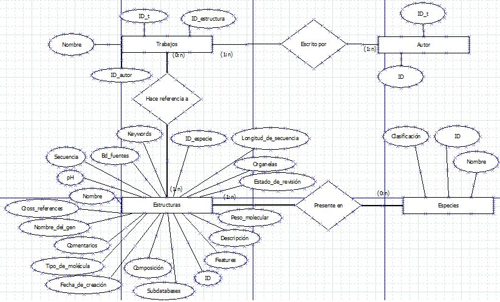

# Estructuras de proteínas

Representación del sistema:  

## Entidades:  

### Estructura:  

nombre: nombre de la estructura.
ph: concentración salina a la que la estructura es funcional.
id_especie: identificación de la especie a la que corresponde la estructura.
bd_fuentes: base de datos de donde proviene. 
id: número de identificación.
estado_de_revision: indica si la estructura fue o no revisada.
tipo_de_molecula: si es proteína o AN.
subdatabases: bases de datos adicionales de donde obtener información sobre la estructura.
longitud_de_secuencia: longitud de secuencia.
fecha_de_creacion: fecha de ingreso de estructura a la base de datos.
descripcion: información de la estructura.
keywords: clave.
organelas: posibles ubicaciones de la estructura.
nombre_del_gen: nombre del gen que expresa la estructura.
ross_references:
composicion: conjunto de elementos que componen la estructura. NO
peso_molecular: peso de la estructura. NO
secuencia: orden de nucleótidos o AA que conforman la estructura. SI
comentarios: información adicional sobre la estructura. SI
features: características.

### Especies:  

nombre: nombre de la especie.
id: identificación de la especie.
clasificacion: linaje de donde proviene la especie.

### Autor:  

id: identificación del autor.
id_t: identificación del trabajo en el que el autor ha participado.

### Trabajos:  

id_t: número de trabajo.
id_estructura: identificación de la estructura de la que trata el trabajo.
nombre: título de la publicación.
id_autor: identificación del autor que participó en la publicación del trabajo.